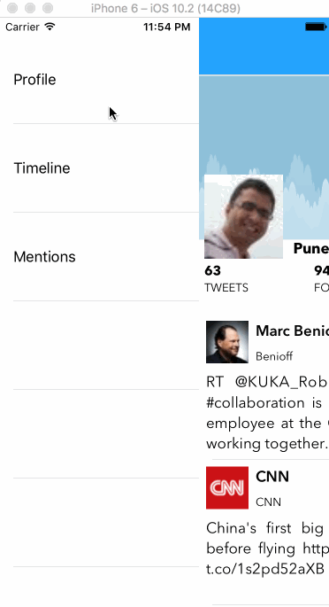

# Project 4 - **Twitter Redux**

**Twitter Redux** is a demo Twitter app .

Time spent: 8 hours

## User Stories

The following **required** functionality is completed:

- Hamburger menu
  - [x] Dragging anywhere in the view should reveal the menu.
  - [x] The menu should include links to your profile, the home timeline, and the mentions view.
  - [x] The menu can look similar to the menu below or feel free to take liberty with the UI.

- Profile page

  - [x] Contains the user header view
  - [x] Contains a section with the users basic stats: # tweets, # following, # followers
  - [x] Shows the user timeline

- Home Timeline

  - [x] Tapping on a user image should bring up that user's profile page

The following **optional** functionality is completed:

- Profile Page
  - [ ] Optional: Implement the paging view for the user description. (med)
  - [ ] Optional: As the paging view moves, increase the opacity of the background screen. See the actual Twitter app for this effect (med)
  - [ ] Optional: Pulling down the profile page should blur and resize the header image. (high)

- Account switching
  - [ ] Optional: Long press on tab bar to bring up Account view with animation (low)
  - [ ] Optional: Tap account to switch to (low)
  - [ ] Optional: Include a plus button to Add an Account (med)
  - [ ] Optional: Swipe to delete an account (med)

## Video Walkthrough

Here's a walkthrough of implemented user stories:

## License

    Copyright [yyyy] [name of copyright owner]

    Licensed under the Apache License, Version 2.0 (the "License");
    you may not use this file except in compliance with the License.
    You may obtain a copy of the License at

        http://www.apache.org/licenses/LICENSE-2.0

    Unless required by applicable law or agreed to in writing, software
    distributed under the License is distributed on an "AS IS" BASIS,
    WITHOUT WARRANTIES OR CONDITIONS OF ANY KIND, either express or implied.
    See the License for the specific language governing permissions and
    limitations under the License.
